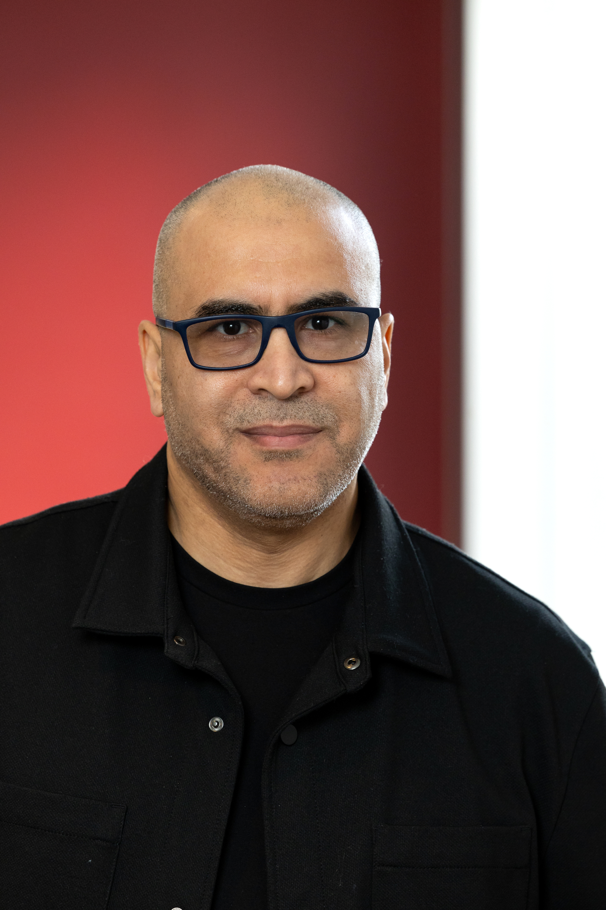

# Younes IKLI — Data Engineer

  
  

    

      
      &nbsp;
      
      &nbsp;
      
    

    
<strong>Disponible immédiatement</strong>

  

---

## À propos

Data Engineer depuis trois ans, j'interviens sur toute la chaîne de la donnée : du cadrage du besoin avec les équipes métier jusqu'à des données fiables, testées et prêtes à l'emploi. J'applique à la data les bonnes pratiques du développement logiciel : tests automatisés, CI/CD, code versionné et documenté.

Mon parcours est atypique, mais chaque étape a été un choix. J'ai commencé dans l'enseignement, avec une passion pour l'informatique, Linux et l'open source, que j'ai d'abord vécue dans le monde associatif. J'ai ensuite repris une licence par passion, en parallèle de mon travail, puis un master pour faire de la data mon métier.

De ce parcours, j'ai gardé le goût d'aider et de transmettre, dans une revue de code, une documentation ou une simple explication à un(e) collègue. Curieux de nature, je continue d'apprendre à chaque projet. Enfin, la confidentialité et le secret professionnel font naturellement partie de ma façon de travailler.

**[Voir les projets réalisés →](./projets/index.md)**

---

## Stack technique

  

    
Langages

    

      Python
      SQL
      Bash
    

  

  

    
Transformation & Orchestration

    

      dbt
      Airflow
    

  

  

    
Stockage & Bases de données

    

      BigQuery
      Snowflake
      PostgreSQL
      MongoDB
    

  

  

    
DevOps

    

      Terraform
      Docker
      GitHub Actions
      GitLab CI
      Git
    

  

  

    
Visualisation & Reporting

    

      Looker Studio
    

  

  

    
IA & LLM

    

      RAG
      LangChain
      LangGraph
      Base vectorielle
      LLM
    

  

---

## Expériences clés

  

    

      <strong>INRIA — Data Engineer (CDD)</strong>
      Lille · Sept. 2024 – Avr. 2026
    

    
Projet européen de recherche avec plusieurs partenaires : une plateforme où chaque hôpital garde ses données chez lui, tandis que les chercheurs lancent leurs analyses sur l'ensemble des sites. Au sein d'une équipe de six ingénieurs : modèles de transformation dbt et tests automatiques pour garantir un format commun à tous les sites, intégration continue avec GitLab CI et conteneurisation Docker, environnement de test sur GCP, documentation (MkDocs). Une première version est installée dans trois hôpitaux pilotes. Projet mené en anglais.

  

  

    

      <strong>APTEEUS — Data Engineer (Alternance)</strong>
      Lille · Jan. – Juil. 2023
    

    
Seul profil technique du projet. Enrichissement de la base de données interne avec plusieurs sources externes : schéma validé avec les équipes métier, pipelines de fusion garantissant la qualité des données et la traçabilité de chaque information, interface simple permettant à l'équipe de relancer les traitements en autonomie. Résultat : une base de référence unique et fiable (<strong>MDM</strong>).

  

  

    

      <strong>CHU de Lille &amp; CIC-IT — Machine Learning Engineer (Projet de Master)</strong>
      Lille · Sept. 2022 – Juin 2023
    

    
Classification des crises d'épilepsie à partir de la variabilité de la fréquence cardiaque, sur des données cliniques déséquilibrées : préparation des données, feature engineering, entraînement et évaluation de modèles (Scikit-learn). Le projet a mis en évidence la faisabilité de la détection des crises à partir d'un signal cardiaque.

  

  

    

      <strong>Alicante (OSPI) — Analytics Engineer (Stage)</strong>
      Lille · Avr. – Août 2022
    

    
Éditeur de logiciels pour les établissements de santé. Automatisation de l'analyse d'activité réalisée pour chaque nouveau client : contrôle de la qualité des données, calcul des indicateurs et rapports multi-formats, avec un même traitement réutilisable pour chaque nouvel établissement.

  

  

    

      <strong>Enseignant, formateur et tuteur en informatique</strong>
      1999 – 2023
    

    
Enseignement en primaire, puis enseignement de l'informatique au collège et au lycée ; formations techniques au sein d'une association dédiée à Linux et à l'open source (Linux, algorithmique, bases de données), et tutorat Python à l'Université de Lille (2020–2023).

  

---

## Formation

**Master Data Science en santé** — Université de Lille · 2023  
**Master MEEF Informatique** — Université de Lille · 2021  
**Licence Mathématiques & Informatique – Génie logiciel** — Université Ibn Zohr · 2015

---

## Bénévolats & Associations

- **Membre du Conseil de Développement de la MEL — France** *(Métropole Européenne de Lille)* — participation aux orientations stratégiques du territoire. · *depuis 2025*
- **Conseiller (ex-président) de l'association ALIS — Maroc** *(promotion du logiciel libre, open source et Linux)* · *depuis 2008*

---
