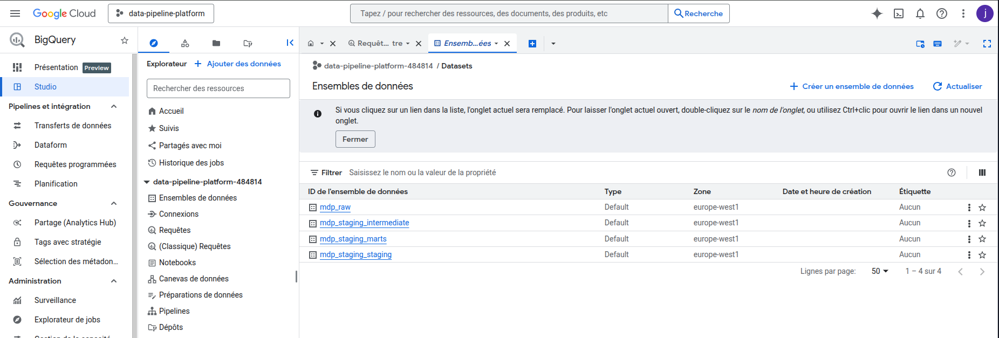

# Projet : Marketing Data Platform

**L'objectif :** Construire une infrastructure robuste capable d'unifier les données de Google Ads et Meta Ads pour fournir une vision business transverse, fiable et automatisée.

> **Stack :** Python, Airflow, dbt, BigQuery, Docker, GitHub Actions.

---

## Architecture Technique

Cette plateforme repose sur un découplage strict entre le transport de la donnée et sa valorisation :

1.  **Ingestion (Python + Airflow) :** Extraction via des connecteurs modulaires, gestion de l'idempotence et chargement dans le `RAW Layer` de BigQuery.
2.  **Transformation (dbt) :** Passage par 4 couches de modélisation (Staging, Intermediate, Marts) pour garantir la qualité et la réutilisabilité.
3.  **Orchestration :** Un DAG Airflow centralise le cycle de vie, avec des Task Groups pour paralléliser l'ingestion.

---

## Aperçu de la plateforme

### 1. Orchestration & Monitoring (Airflow)

*Vue du DAG orchestrant l'ingestion parallélisée et le déclenchement des transformations dbt. Chaque étape inclut une logique de retry et un logging détaillé.*

### 2. Modélisation & Lignage (dbt)

*Structure des transformations en couches. Le passage du `Staging` au `Mart` permet d'isoler les règles de gestion métier de la structure brute des APIs.*

### 3. Qualité & Exposition (BigQuery)

*Exposition des Data Marts finaux dans BigQuery. Les données sont nettoyées, typées et prêtes pour être consommées par un outil de BI (Looker, Tableau).*

---

## 🛠️ Le Regard "Data Engineer" (Infrastructure)

*Comment j'ai assuré la robustesse du système :*

* **Design Pattern "Connector" :** Développement d'une interface Python abstraite. L'ajout d'une nouvelle source se fait par configuration, garantissant une maintenance simplifiée.
* **Ingestion Idempotente :** Utilisation de stratégies de chargement `Write-Truncate` sur partitions quotidiennes pour permettre de relancer n'importe quel pipeline sans risque de doublons.
* **Contrôles de Volumétrie :** Script de monitoring comparant le nombre de lignes ingérées avec les moyennes historiques pour détecter les anomalies d'API.

---

## 📊 Le Regard "Analytics Engineer" (Modélisation)

*Comment j'ai transformé la donnée en actif métier :*

* **Unification Cross-Canal :** Harmonisation des schémas de Google et Meta (ex: `spend`, `clicks`, `impressions`) dans un modèle unique pour calculer un **ROAS global**.
* **Data Quality as a Code :**
    * Implémentation de tests `not_null` et `unique` sur les clés primaires.
    * Tests de cohérence métier (ex: le coût ne peut pas être négatif).
* **Documentation & Gouvernance :** Chaque colonne est documentée dans dbt, facilitant l'onboarding des analystes et la compréhension des KPIs.

---

## 📈 Résultats & Impact

* **Fiabilité :** Détection proactive des erreurs d'API avant qu'elles n'atteignent les rapports métier.
* **Agilité :** Passage d'une gestion manuelle par exports CSV à une plateforme 100% automatisée.
* **Scalabilité :** Architecture prête à accueillir de nouvelles sources ou des modèles de prédiction (Machine Learning).

---

## 🔗 Liens du projet

* **[Code Source sur GitHub](https://github.com/y-ikli/media-data-platform)** : Exploration de l'architecture, des DAGs Airflow et des modèles dbt.
* **[Documentation Technique sur Github](https://github.com/y-ikli/media-data-platform/blob/main/docs/architecture.md)** : Détails des choix d'ingénierie et de la modélisation des données.

---