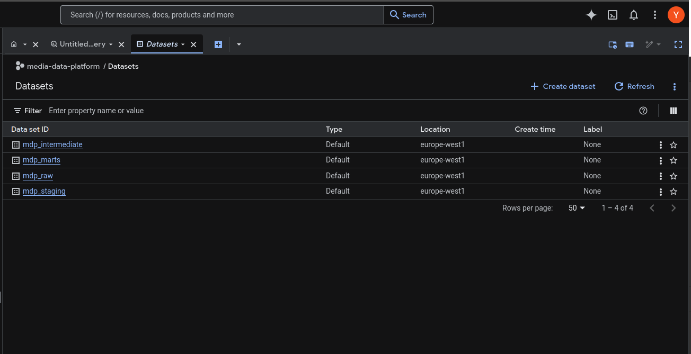
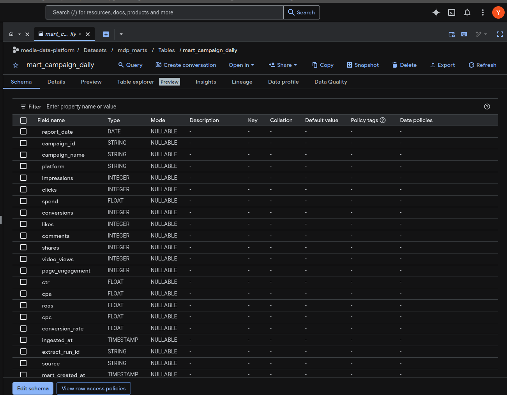
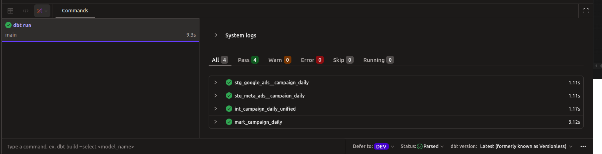
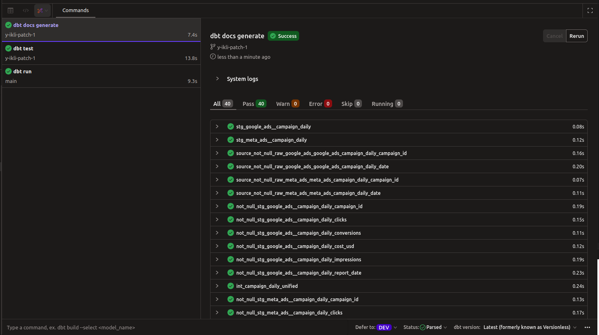
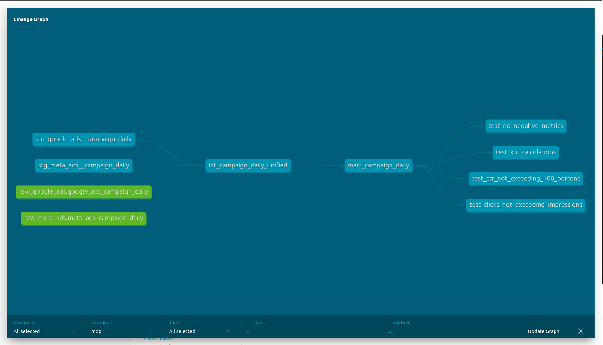
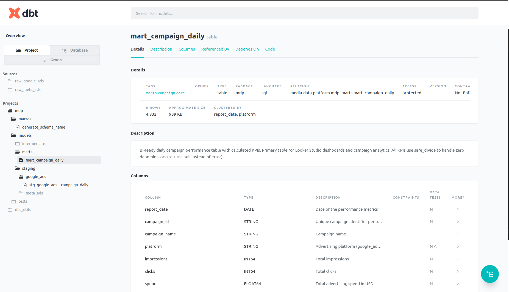

# Projet : Marketing Data Platform

**Pipeline ELT de données publicitaires** — Meta Ads (API réelle) + Google Ads — vers des data marts analytiques dans Google BigQuery, avec transformations dbt et validation qualité automatisée.

> **Stack :** Python, dbt, BigQuery, GitHub Actions

---

## Contexte

Une agence marketing gère des campagnes publicitaires sur plusieurs plateformes simultanément — Meta Ads, Google Ads, et potentiellement d'autres.
Chaque plateforme expose ses données dans son propre format, avec ses propres nommages et ses propres métriques.
Résultat : les équipes passent du temps à consolider des exports manuels, les KPI sont recalculés différemment selon la source, et personne n'a une vision cross-platform fiable.

Le besoin est simple : une seule table, une seule définition du CTR, une seule source de vérité pour comparer Meta et Google sur les mêmes dates et les mêmes campagnes — et prendre de meilleures décisions budgétaires.

Pour y répondre, j'ai construit un pipeline ELT complet :

- Connecteurs Python par source (Meta via API réelle, Google via interface simulée) avec une classe abstraite commune — extensible à TikTok, LinkedIn sans refonte
- Chargement des données brutes dans BigQuery avec métadonnées d'ingestion tracées par UUID
- Transformations dbt en 3 couches : staging (nettoyage par source), intermediate (union des schémas), mart (KPI calculés)
- 36 tests de qualité automatiques validant la cohérence des données à chaque run
- Pipeline CI/CD GitHub Actions : lint, tests unitaires, validation dbt à chaque push

Au final : **4 727 lignes** dans la table analytique finale, **36 tests PASS**, et un dashboard Looker Studio connecté directement — sans transformation supplémentaire.

> Sans ce socle, les décisions budgétaires (augmenter le budget Meta ou Google ?) reposent sur des chiffres non comparables. Ce projet résout exactement ça.

En production avec des campagnes actives, ce pipeline s'exécuterait quotidiennement via Airflow — chaque matin, les données J-1 sont disponibles dans Looker Studio sans intervention manuelle.

---

## Détail du projet

Une campagne publicitaire est terminée. On veut analyser ses performances de manière consolidée : CTR, CPC, CPA, ROAS — par plateforme, par campagne, par période.

Chaque plateforme (Meta, Google) expose ses propres schémas et nommages. Ce projet construit le socle de données qui normalise tout en une table analytique unique, cohérente et validée.

---

## Architecture

```
Meta Ads API (réelle)          Google Ads (simulé)
        │                              │
        ▼                              ▼
  Python connector             Python connector
  (facebook-business SDK)      (même interface — Strategy pattern)
        │                              │
        └──────────────┬───────────────┘
                       ▼
              mdp_raw (BigQuery)
              Données brutes + métadonnées d'ingestion
              Partitionné par date — idempotent
                       │
                       ▼
              dbt Transformations
              ├─► Staging       — typage, nettoyage, standardisation par source
              ├─► Intermediate  — union des schémas (UNION ALL)
              └─► Marts         — KPI calculés, prêts pour la BI
                       │
                       ▼
              Looker Studio dashboard
```

> En production avec des campagnes actives, un orchestrateur comme Apache Airflow déclencherait ce pipeline quotidiennement pour ingérer les nouvelles données J-1, relancer dbt et valider la qualité automatiquement.

---

## Données réelles

| Source | Lignes | Campagnes | Spend | Période |
|--------|--------|-----------|-------|---------|
| Meta Ads (réelle) | 447 | 46 | $1 402 | 2023-04-23 → 2025-08-25 |
| Google Ads (simulé) | 4 280 | 5 | — | même période |

---

## Aperçu


---
### BigQuery — architecture Medallion

<!-- Capture : console BigQuery, panneau gauche
     Montre les 4 datasets : mdp_raw, mdp_staging, mdp_intermediate, mdp_marts
     Prouve l'architecture en couches dans le vrai cloud -->

*Architecture Medallion dans BigQuery : 4 datasets avec responsabilités distinctes.*

---

### BigQuery — table finale

<!-- Capture : console BigQuery, onglet Preview de mart_campaign_daily
     Montre les colonnes (report_date, campaign_id, platform, impressions, clicks, spend, ctr, cpc, cpa, roas...)
     Idéalement : faire défiler pour voir à la fois des lignes meta_ads et google_ads côte à côte
     Le nombre de lignes visible en bas (~4 727 rows) est un bon signal -->

*Table `mart_campaign_daily` : ~4 700 lignes, colonnes KPI calculées, données Meta réelles + Google simulées.*

---

### Modèles dbt — run results et les tests

<!-- Capture : résultat de `dbt run` + `dbt test` dans dbt Cloud ou terminal
     Montre les 4 modèles en vert (PASS) et les 36 tests PASS avec les temps d'exécution -->


*4 modèles PASS, 36 tests PASS. Aucune erreur, aucun warning.*


---
### Lineage dbt — chaîne de transformation

<!-- Capture : onglet Lineage dans dbt Cloud IDE
     Montre les 4 nœuds en chaîne :
     raw_meta_ads + raw_google_ads (vert) → stg_* → int_campaign_daily_unified → mart_campaign_daily
     Le lineage prouve la séparation claire ingestion / transformation et la traçabilité end-to-end -->

*Lineage graph dbt : sources (vert) → staging → intermediate → marts. Séparation claire entre la couche d'ingestion Python et la couche de transformation dbt.*

### Documentation dbt 
<!-- Capture : onglet Documentation dans dbt Cloud IDE
     Montre la documentation auto-générée pour mart_campaign_daily
     Idéalement : faire défiler pour montrer les descriptions de colonnes, les formules des KPI, les tests associés -->

---

## Détail technique

### 1. Ingestion Python — pattern Strategy

Classe abstraite `DataSourceConnector` avec 3 étapes :

```
extract()            ← implémenté par chaque source
load_raw()           ← enrichissement metadata (ingested_at, extract_run_id UUID)
write_to_bigquery()  ← écriture en WRITE_APPEND, déduplication par partition possible
```

Ajouter une nouvelle source (TikTok, LinkedIn) = implémenter uniquement `extract()`.

### 2. Architecture Medallion BigQuery

| Dataset | Rôle | Type |
|---------|------|------|
| `mdp_raw` | Données brutes, audit complet | Table partitionnée |
| `mdp_staging` | Standardisation par source | Vue dbt |
| `mdp_intermediate` | Union des sources, schéma commun | Vue dbt |
| `mdp_marts` | KPI finaux, optimisés pour la BI | Table clusterisée |

### 3. Transformations dbt

KPI calculés avec `SAFE_DIVIDE` (jamais de division par zéro) :

| KPI | Formule |
|-----|---------|
| CTR | clicks / impressions |
| CPC | spend / clicks |
| CPA | spend / conversions |
| ROAS | conversions / spend |
| Taux de conversion | conversions / clicks |

Grain garanti : **1 ligne = 1 campagne × 1 date × 1 plateforme**

### 4. Qualité des données — 36 tests dbt

- `not_null` sur toutes les clés et métriques
- `accepted_values` sur `platform`
- `unique_combination_of_columns` sur (report_date, campaign_id, platform)
- Tests SQL : CTR ≤ 100%, clicks ≤ impressions, métriques ≥ 0, formules KPI mathématiquement correctes

### 5. CI/CD — GitHub Actions

- Lint Python (`pylint`) — fail si score < 10/10
- Tests unitaires (`pytest`)
- Compilation et parsing dbt (sans credentials BigQuery)

---

## Choix technologiques et alternatives

### Ingestion : connecteur Python custom vs outils managés

| Outil | Type | Quand l'utiliser |
|-------|------|-----------------|
| **Connecteur Python custom** ← *ce projet* | Code maîtrisé | Sources non supportées, apprentissage, contrôle total |
| **Fivetran** | SaaS managé | En production, budget disponible, zéro maintenance, 300+ connecteurs |
| **Airbyte** | Open source | Self-hosted, même richesse que Fivetran, coût infrastructure |
| **Singer** | Framework léger | Connecteurs custom sans réinventer la roue |

**Pourquoi le custom ici ?** Projet portfolio — comprendre ce que font ces outils sous le capot. En production réelle, Fivetran ou Airbyte seraient plus adaptés : maintenabilité, monitoring natif, gestion des schémas évolutifs.

---

### Transformation : pourquoi dbt ?

En entreprise, les transformations SQL vivent souvent dans des scripts éparpillés, sans tests, sans documentation, sans gestion des dépendances. Résultat : personne ne sait quel chiffre est "le bon".

dbt résout ça :

| Problème réel | Solution dbt |
|---------------|-------------|
| "Qui a modifié ce KPI ?" | Tout est dans git, versionné |
| "Ce chiffre est calculé comment ?" | Lineage graph + documentation auto |
| "Les données sont-elles fiables ?" | Tests automatiques à chaque run |
| "Deux équipes ont deux définitions du CTR" | Une seule source de vérité — le modèle dbt |

**Alternatives :**
- **SQL pur dans BigQuery** → pas de gestion des dépendances, pas de tests, pas maintenable à l'échelle
- **Spark / Dataproc** → justifié pour des volumes > TB ou des transformations distribuées complexes
- **pandas** → en mémoire, pour l'exploration ou les petits volumes

---

### Data Warehouse : pourquoi BigQuery ?

| Critère | BigQuery | Snowflake | Redshift |
|---------|----------|-----------|---------|
| **Modèle de prix** | Pay-per-query (idéal projet) | Pay-per-compute (crédits) | Instance toujours allumée |
| **Scalabilité** | Serverless, auto | Serverless | Nœuds à gérer |
| **Intégration GCP** | Native | Via connecteurs | AWS natif |
| **SQL** | Standard SQL | Standard SQL | PostgreSQL-like |
| **Cas d'usage** | Analytique, grands volumes | Analytique, multi-cloud | AWS natif |

**Pourquoi BigQuery ici ?** Compte GCP disponible, pricing adapté à un projet portfolio (paiement à la requête, pas d'instance permanente), intégration native avec Looker Studio.

**Ce projet est transférable à Snowflake ou Redshift** : le code dbt est portable — changer le profil `profiles.yml` suffit. La logique SQL ne change pas.

---

## Points techniques notables

- **Idempotence** : pipeline rejouable sans créer de doublons — `extract_run_id` tracent chaque run
- **Traçabilité** : chaque ligne porte un `extract_run_id` (UUID) liant la donnée à son run d'ingestion
- **Schéma cross-platform** : `campaign_id` casté en STRING (Google = string, Meta = entier) pour que le `UNION ALL` fonctionne
- **Valeurs manquantes gérées** : `conversions` null pour Meta (non fourni par l'API) — KPI CPA/ROAS null pour Meta, ce qui est correct

---

## Repo

[github.com/y-ikli/media-data-platform](https://github.com/y-ikli/media-data-platform)
