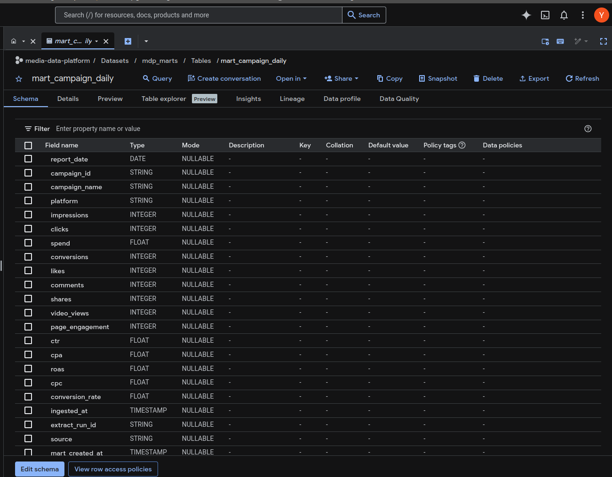
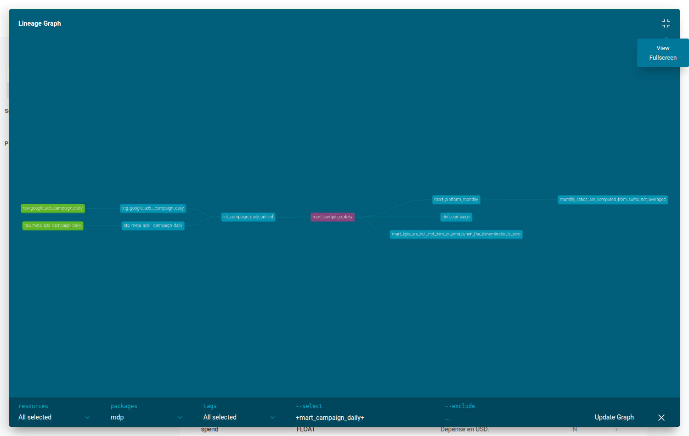
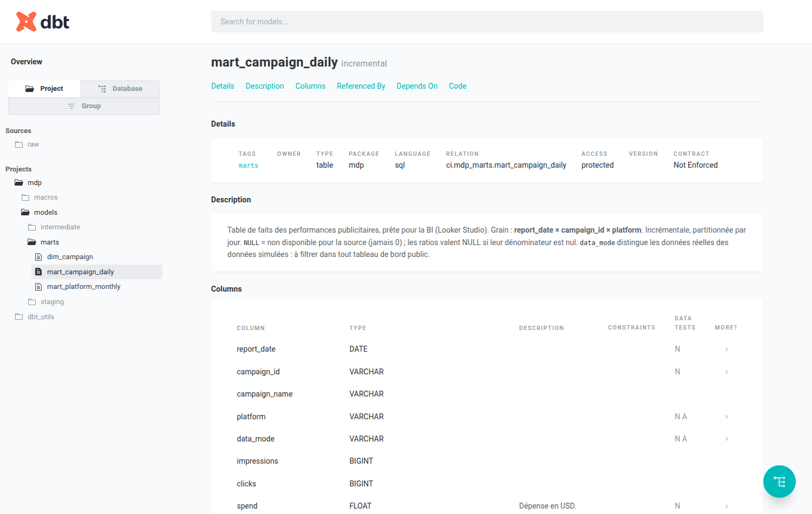

# Media Data Platform

**Projet dbt sur BigQuery** : unifier les données publicitaires de Meta Ads (API réelle) et de Google Ads (données simulées) dans des tables analytiques fiables, avec une seule définition par indicateur, des modèles en couches et des tests automatiques.

> **Stack :** dbt · BigQuery · SQL · Python · GitHub Actions

**Repo :** [github.com/y-ikli/media-data-platform](https://github.com/y-ikli/media-data-platform)

---

## Contexte

Une agence marketing gère des campagnes sur Meta et Google en même temps. Chaque plateforme livre ses données dans son propre format : noms différents, métriques incohérentes, exports manuels.

**Problème concret :** le CTR n'est pas calculé de la même façon selon la source. Comparer Meta et Google sur les mêmes campagnes et les mêmes dates devient impossible.

**Solution :** un projet dbt qui réunit les deux sources dans une seule table analytique, avec une définition unique de chaque indicateur, testée et documentée.

---

## Architecture

```
Meta Ads API (réelle)          Google Ads (simulé)
        │                              │
        ▼                              ▼
  Connecteur Python            Connecteur Python
        │        (même interface)      │
        └──────────────┬───────────────┘
                       ▼
              BigQuery — données brutes
              partitionnées par date, rejouables sans doublon
                       │
                       ▼
              dbt — 3 couches
              ├─► Staging       — nettoyage et typage, un modèle par source
              ├─► Intermediate  — union des deux sources dans un schéma commun
              └─► Marts         — table quotidienne par campagne (incrémentale),
                                  synthèse mensuelle par plateforme, dimension campagne
```

---

## Le projet dbt

| Élément | Ce qui est mis en place |
|---|---|
| **Modélisation en couches** | Staging (un modèle par source), intermediate (schéma commun), marts (faits quotidiens, synthèse mensuelle, dimension campagne) |
| **Modèle incrémental** | La table quotidienne retraite une fenêtre glissante de jours, car les plateformes corrigent leurs chiffres après coup ; partitionnée par date et clusterisée sur BigQuery |
| **Macros** | Calcul sûr des ratios (pas de division par zéro) et fonctions de dates compatibles avec plusieurs moteurs SQL |
| **Tests** | Tests génériques (`not_null`, `unique`, `accepted_values`), tests sur combinaisons de clés (dbt_utils), règles métier (CTR ≤ 100 %, clics ≤ impressions) et tests unitaires dbt sur les calculs d'indicateurs |
| **Sources** | Sources déclarées avec contrôle de fraîcheur des données |
| **Documentation** | Colonnes et modèles décrits, lineage généré automatiquement |
| **CI** | À chaque modification : exécution complète de dbt (modèles et tests) et vérification que le projet se charge sur BigQuery |

---

## Résultats

| Source | Lignes | Campagnes | Période |
|--------|--------|-----------|---------|
| Meta Ads (réelle) | 447 | 46 | 2023-04 → 2025-08 |
| Google Ads (simulé) | 4 280 | 5 | même période |

**Table finale :** 4 727 lignes · 1 ligne = 1 campagne × 1 date × 1 plateforme · 51 tests dbt au vert (47 tests de données, 4 tests unitaires)

Indicateurs calculés : CTR, CPC, CPA, taux de conversion, ROAS (valeur des conversions / dépense).

---

## Aperçu


*Table finale : indicateurs Meta et Google unifiés.*


*Lineage dbt : de la source brute aux indicateurs, chaque étape est traçable.*


*Documentation générée automatiquement : colonnes, descriptions, tests.*

---

## Ce qui rend le pipeline fiable

- **Rejouable sans doublon** : relancer un chargement ne duplique jamais les données.
- **Traçable** : chaque ligne est reliée à l'exécution qui l'a chargée.
- **Une seule définition par indicateur**, versionnée dans Git et documentée.
- **Testé à chaque modification** : 51 tests dbt et CI GitHub Actions (lint, tests Python, exécution de dbt).

Détail technique et choix d'architecture : voir le [dépôt GitHub](https://github.com/y-ikli/media-data-platform).
