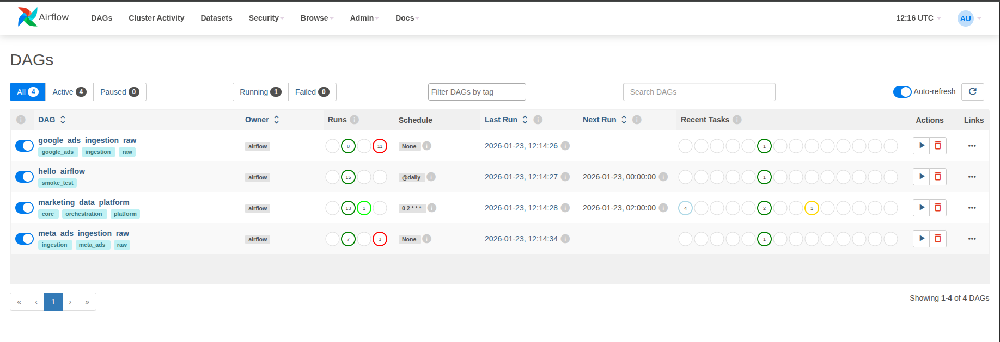

<h1 style="color:#fb8c00;font-weight:700;">Projets</h1>

Découvrez mes principaux projets ci-dessous.

---

## Plateforme Data Marketing

  
  
  
  

**Une plateforme data marketing moderne, modulaire et cloud-ready pour unifier, fiabiliser et valoriser les données issues de multiples régies publicitaires.**

### Problème
Les données marketing proviennent de multiples plateformes (Google Ads, Meta Ads, TikTok, LinkedIn, etc.) avec :
- Schémas hétérogènes et définitions KPI non harmonisées
- Ingestions peu industrialisées et fragiles
- Couplage fort entre reporting et systèmes sources
- Absence de qualité de données garantie

### Solution
- Architecture cloud-ready, modulaire et extensible
- Ajout de nouveaux connecteurs via interface standardisée
- Pipelines d'ingestion incrémentaux, idempotents et testés (Airflow, dbt, CI/CD)
- Séparation stricte des couches (Raw → Staging → Intermediate → Marts)
- Monitoring, tests automatisés, documentation et traçabilité

### Impact
- Intégration de nouvelles sources en moins d’un jour (vs. semaines)
- 0 anomalies en production grâce aux tests automatisés
- Centralisation et fiabilité des données pour accélérer la prise de décision et l’innovation data

### Fonctionnalités principales
- Ingestion incrémentale et idempotente de données multi-sources
- Orchestration centralisée (Airflow)
- Transformations SQL-first (dbt)
- Monitoring, tests et CI/CD intégrés
- Prêt pour le cloud (BigQuery, Snowflake)

## Aperçu de la plateforme — de l’orchestration à l’analyse

### Orchestration centralisée

*Vue des DAGs Airflow orchestrant l’ingestion multi-sources et les transformations analytiques.*

---

### Ingestion des données brutes (Raw layer)

*Données brutes issues de Google Ads et Meta Ads*

---

### Transformations de données (SQL-first)

*Transformations SQL-first avec dbt, structurées en couches staging, intermediate et marts.*

---

### Exposition des données analytiques

*Jeux de données analytiques orientés métier, conçus pour la consommation BI, le reporting et les analyses marketing.*

---

### Voir le projet
👉 Code source, documentation et architecture détaillée disponibles sur GitHub :  
https://github.com/y-ikli/media-data-platform

---

