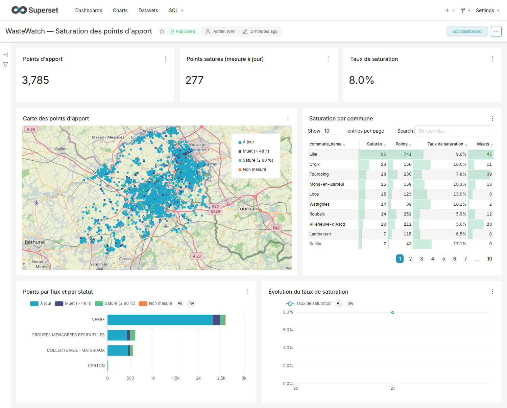
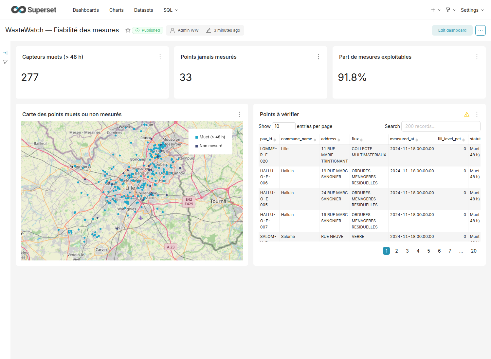
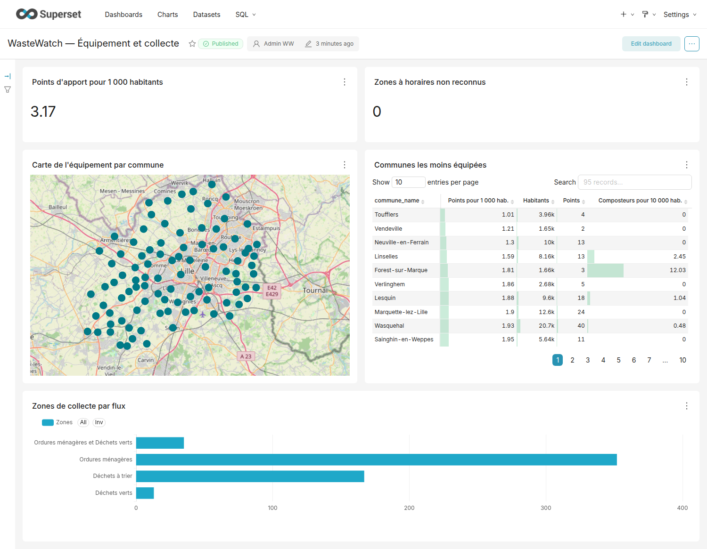
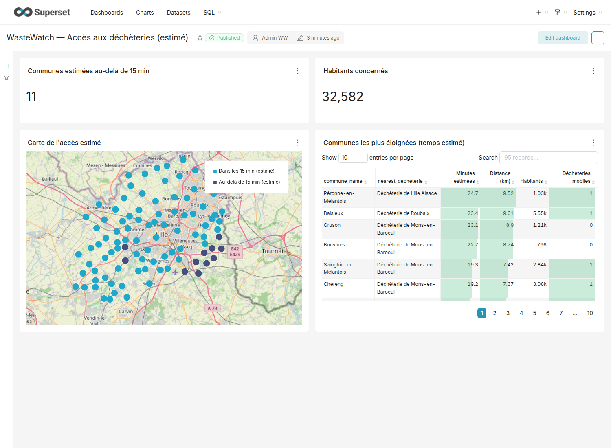

# Observatoire Déchets MEL

**Suivi du service de gestion des déchets de la Métropole Européenne de Lille (MEL)**, à partir de ses données ouvertes : des API publiques au tableau de bord, avec un pipeline complet — extraction, historique, entrepôt, transformations, restitution — conçu pour un coût d'infrastructure minimal.

> **Stack :** Python · GCS · Snowflake · dbt · Terraform · GitHub Actions · Apache Superset
>
> **Statut :** pipeline exécuté et testé de bout en bout sur les données réelles de l'API MEL, tableau de bord construit (4 pages, 21 graphiques). L'entrepôt Snowflake et l'infrastructure Terraform sont écrits et validés, mais pas encore exécutés sur un compte réel. Dépôt privé — **code source disponible sur demande**.

---

## Le besoin

La MEL publie sur son portail ouvert l'état de ses points d'apport volontaire (bornes à verre, papier, emballages), ses déchèteries, ses composteurs collectifs et ses zones de collecte. Chaque jeu est publié séparément, sans historique, et rien ne répond directement aux questions d'un exploitant ou d'un élu :

- Quels points d'apport risquent de déborder, et lesquels ne remontent plus de mesure ?
- Quelles communes sont les moins équipées par habitant ?
- Quelles communes semblent éloignées d'une déchèterie, au regard de l'engagement des 15 minutes ?
- Comment la saturation évolue-t-elle dans le temps ?

## Ce que le projet apporte

| Question | Indicateur |
|---|---|
| Quels points sont saturés ? | Niveau de remplissage ≥ 90 %, hors capteurs muets |
| Quels capteurs sont muets ? | Dernière mesure de plus de 48 h avant l'extraction |
| Où manque-t-il d'équipements ? | Points d'apport pour 1 000 habitants, composteurs pour 10 000 |
| Où l'accès à une déchèterie est-il long ? | Temps estimé jusqu'à la déchèterie fixe ouverte la plus proche |
| La collecte couvre-t-elle la commune ? | Zones de collecte et jours desservis par flux |
| La saturation s'améliore-t-elle ? | Série quotidienne par commune et par flux |

Sur l'extrait réel du 21/09/2026 (95 communes, 1,2 million d'habitants, 3 785 points d'apport) : 440 points sont à 90 % ou plus, dont 163 avec une mesure de plus de 48 h ; 277 points sont saturés sur une mesure récente (8,0 % des points mesurés à jour) ; 277 capteurs sont muets, certains depuis novembre 2024 ; **11 communes (32 582 habitants) dépassent 15 minutes** d'après l'estimation, la plus éloignée à 24,7 minutes. Ce dernier chiffre est une estimation à vol d'oiseau majorée, pas un temps routier — la limite est écrite dans le tableau de bord, pas cachée.

## Architecture

```
API MEL (WFS) + API Géo ──► extraction quotidienne (contrats de données) ──► GCS (historique, NDJSON par jour)
                                                                                      │
                                                                          Snowflake (chargement idempotent)
                                                                                      │
                                                                        dbt (staging → intermediate → marts)
                                                                                      │
                                                                              Apache Superset (restitution)

Orchestration : GitHub Actions (cron quotidien)
Infrastructure : Terraform (GCS, identité GitHub sans clé, entrepôt Snowflake avec plafond de crédits)
```

**Choix clés :**

- **Contrats de données déclaratifs** : chaque source a un contrat (colonnes attendues, plages de valeurs, volumétrie, géométrie). Si l'API dérive, l'ingestion échoue et n'écrit rien — plutôt qu'un chiffre faux passé inaperçu. Ces contrôles ont détecté 3 défauts réels de l'API en cours de développement (coordonnées inversées, centre de commune absent, emprise mal estimée).
- **Historique construit, pas hérité** : le niveau de remplissage n'existe qu'au présent chez la source. Chaque jour d'extraction est conservé dans le stockage cloud, ce qui construit la série temporelle que l'API elle-même n'a pas.
- **Idempotence** : rejouer un jour remplace ce jour, sans doublon et sans toucher aux autres — vérifié par un scénario de test à deux instantanés (point disparu, capteur devenu muet).
- **Maîtrise des coûts intégrée dès la conception** : un seul entrepôt, une planification par GitHub Actions plutôt qu'un orchestrateur dédié, une restitution auto-hébergée.

## Qualité

68 contrôles automatisés sur le pipeline dbt (tests de données et tests unitaires), plus une suite de tests Python avec 94 % de couverture. Un capteur qui ne remonte plus de mesure n'est ni compté comme plein ni comme vide : il est isolé et sorti des taux de saturation, pour ne jamais fausser le chiffre affiché.

## Tableau de bord (Apache Superset)

Quatre pages, entièrement décrites dans un script rejouable plutôt que construites à la main dans l'interface.

### Saturation des points d'apport



### Fiabilité des mesures



### Équipement et collecte



### Accès aux déchèteries



## État du projet

Le pipeline d'extraction, les modèles dbt et le tableau de bord tournent sur les données réelles de l'API MEL. Restent à valider : l'exécution du SQL sur Snowflake (testé pour l'instant sur DuckDB), l'application de l'infrastructure Terraform sur un compte réel, et l'accumulation de plusieurs jours de données pour observer une vraie tendance. Le dépôt reste privé le temps de finaliser ces points ; le code, la documentation et le détail des mesures sont disponibles sur demande.
