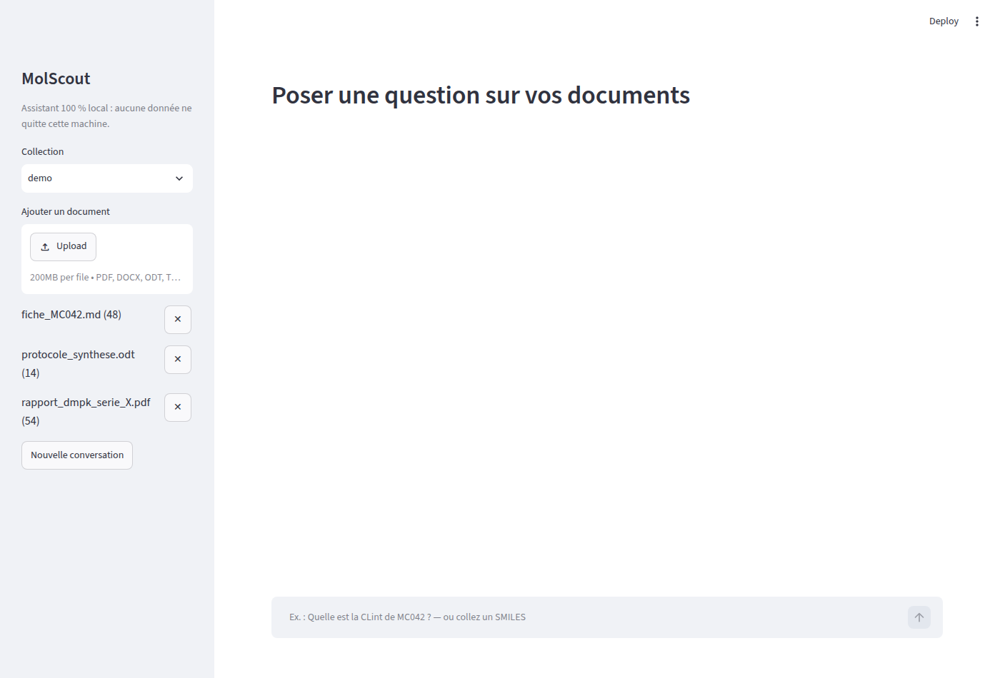
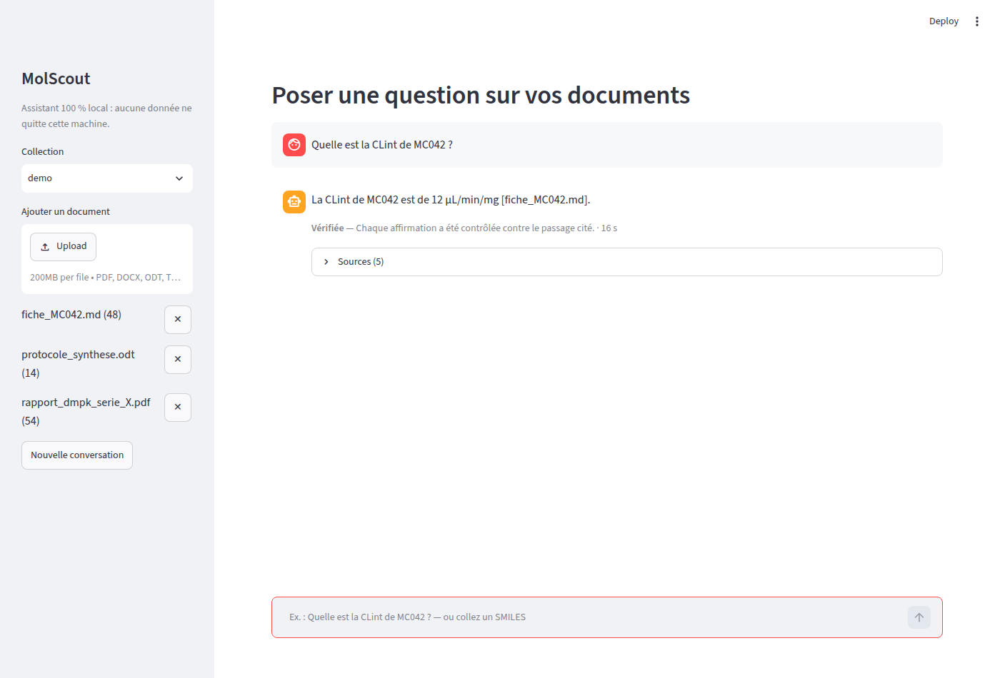
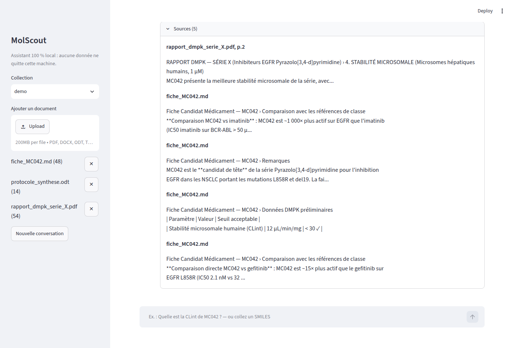

# MolScout

**Assistant de recherche documentaire et de cheminformatique 100 % local**, pour la chimie médicinale et le DMPK — il répond aux questions d'un chimiste à partir de ses propres rapports, avec des sources citées, et calcule les propriétés moléculaires avec RDKit au lieu de les deviner. Aucune donnée ne quitte la machine.

> **Stack :** Python · LangGraph · Ollama · Qdrant · RDKit · FastAPI · Streamlit
>
> **Statut :** prototype avancé, mesuré sur un corpus synthétique. Dépôt privé (données de chimie médicinale sensibles par nature du domaine) — **code source disponible sur demande**.

---

## Contexte

Dans les équipes de recherche pharmaceutique, les documents internes (rapports DMPK, fiches candidats, protocoles de synthèse) s'accumulent et deviennent difficiles à interroger. Les solutions cloud posent un problème de confidentialité sur des données sensibles — brevets, molécules, résultats d'essais.

**Problème :** retrouver une donnée précise dans des dizaines de documents prend du temps, et un modèle de langage laissé seul peut répondre avec assurance à côté de la plaque — mélanger deux composés voisins, ou inventer une valeur plausible.

**Principe du système : un assistant qui ne répond que ce qu'il peut prouver.**

- **Vérification, pas confiance** : chaque affirmation de la réponse est contrôlée, sans LLM, contre le passage exact qu'elle cite (extrait littéral, valeur, unité, composé). Si une affirmation ne passe pas ce contrôle, le système relance une génération guidée, puis répond partiellement ou s'abstient plutôt que d'affirmer à tort.
- **Chimie calculée, pas devinée** : descripteurs moléculaires, règle de Lipinski, similarité, sous-structure et résolution de SMILES viennent de RDKit et d'une chimiothèque locale, jamais du modèle de langage.
- **Local de bout en bout** : aucun appel réseau sortant, télémétrie désactivée dans le code, déploiement Docker sur réseau interne.

## Ce que le système fait

| Capacité | Détail |
|---|---|
| Ingestion PDF, DOCX, ODT, Markdown | Un passage structuré (en-tête, section, page) ; identifiants de composés et SMILES extraits ; propriétés déclarées contrôlées contre RDKit ; ingestion idempotente |
| Questions sur documents | Récupération hybride (dense + lexicale) avec filtre par composé ; réponses citées `[fichier, p.N]` et vérifiées |
| Questions sur une structure | SMILES reconnu et résolu quelle que soit son écriture ; propriétés, similarité de Tanimoto, sous-structure, cohérence déclaré/calculé |
| Conversation | Questions de suivi (« et son CLint ? ») résolues par session |
| Évaluation | 74 cas vérifiables, scorer déterministe, barrière de non-régression en intégration continue |
| Interface | Application web locale (Streamlit) : statut de vérification, sources, structure 2D |

## Architecture

```
Documents ─► extraction ─► passages structurés ─► embeddings + lexical ─► Qdrant
                                     └─► chimiothèque (SQLite)
Question ─► contexte ─► routeur (entités) ─┬─► récupération hybride ─┐
                                           └─► outils RDKit ─────────┤
                                                                     ▼
                                   génération structurée ─► vérification déterministe ─► réponse citée / abstention
```

Composants : LangGraph pour orchestrer le graphe (récupération, outils, génération, vérification) ; Ollama pour le LLM et les embeddings, entièrement en local ; Qdrant pour la recherche vectorielle ; RDKit pour la chimie ; SQLite pour la chimiothèque ; FastAPI pour l'API ; Streamlit pour l'interface.

## Résultats mesurés

Comparaison contre une première version plus simple (recherche seule, sans vérification), sur un jeu de 21 cas avec génération, mesurée sur une machine sans GPU (16 cœurs, 30 Go de RAM, modèle `qwen2.5:7b` en 7 milliards de paramètres) :

| Indicateur | Avant | Après |
|---|---|---|
| Exactitude globale | 43 % | **95 %** |
| Exactitude numérique | 27 % | **91 %** |
| Suffisance du contexte @5 (récupération, 74 cas) | 64 % | **95 %** |
| Latence médiane | 304 s | **67 s** |
| Latence p95 | 1 064 s | 110 s |

**Ce que ces chiffres valent, et ce qu'ils ne valent pas** : le corpus est synthétique et petit (3 documents, 7 composés fictifs, 74 cas) — ces chiffres démontrent un mécanisme (ne pas mélanger les composés, ne citer que ce qui est prouvé), pas une performance sur des documents réels de grande échelle. La cible de latence p95 (≤ 45 s) n'est pas atteinte sur cette machine sans GPU ; les leviers identifiés sont un modèle plus petit ou un GPU.

## Aperçu

### Interface principale


*Assistant local, corpus indexé, prêt à répondre.*

### Réponse vérifiée


*Question posée sur un document réel du corpus de démonstration : réponse citée, statut « Vérifiée » et temps de calcul affichés.*

### Sources citées


*Les passages exacts utilisés pour construire et vérifier la réponse, consultables en un clic.*

## État du projet

Prototype avancé, en évolution active. Le dépôt reste privé : les documents de chimie médicinale traités sont par nature sensibles (composés en développement, résultats non publiés), même quand — comme ici — les données de démonstration sont entièrement fictives. Le code source, la suite de tests et le détail des mesures sont disponibles sur demande.
