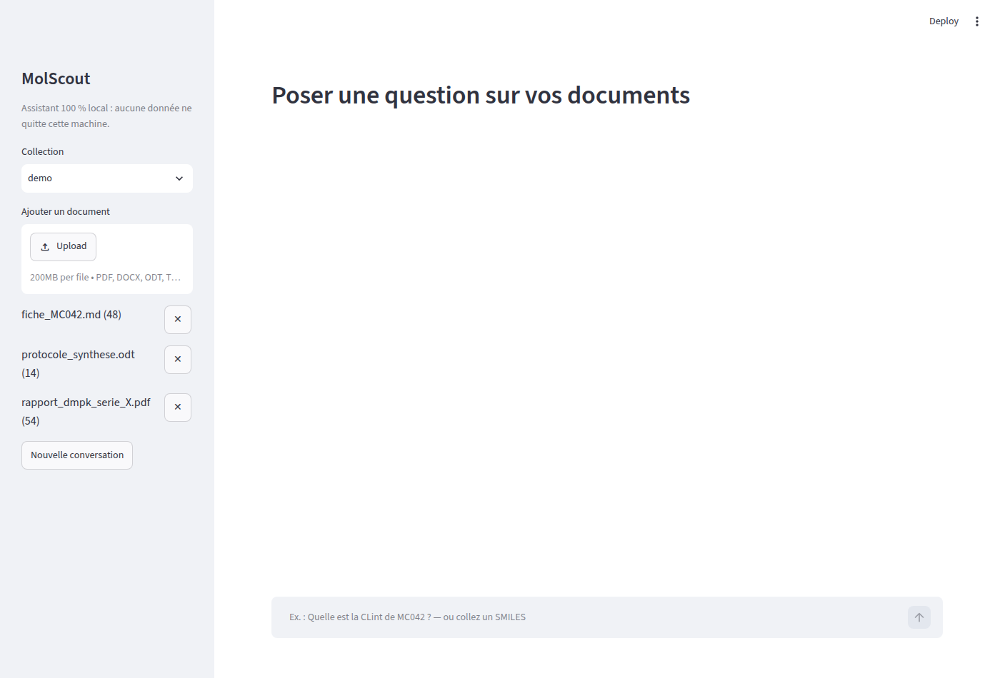
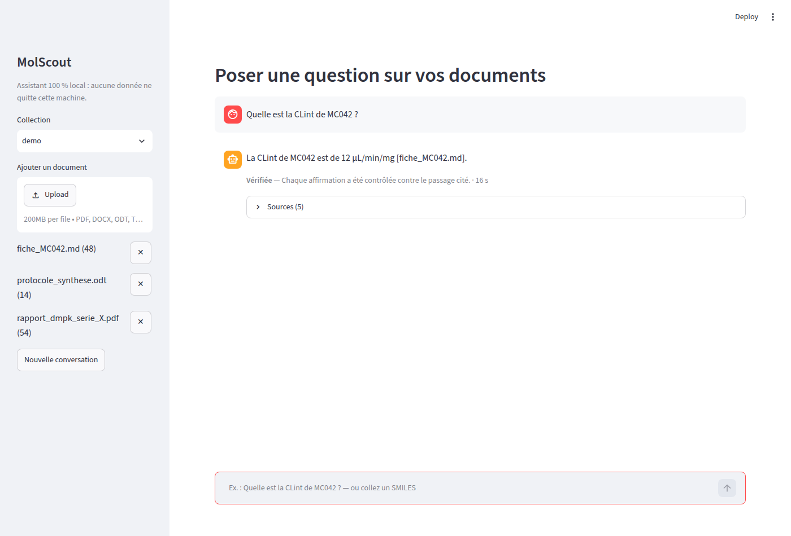
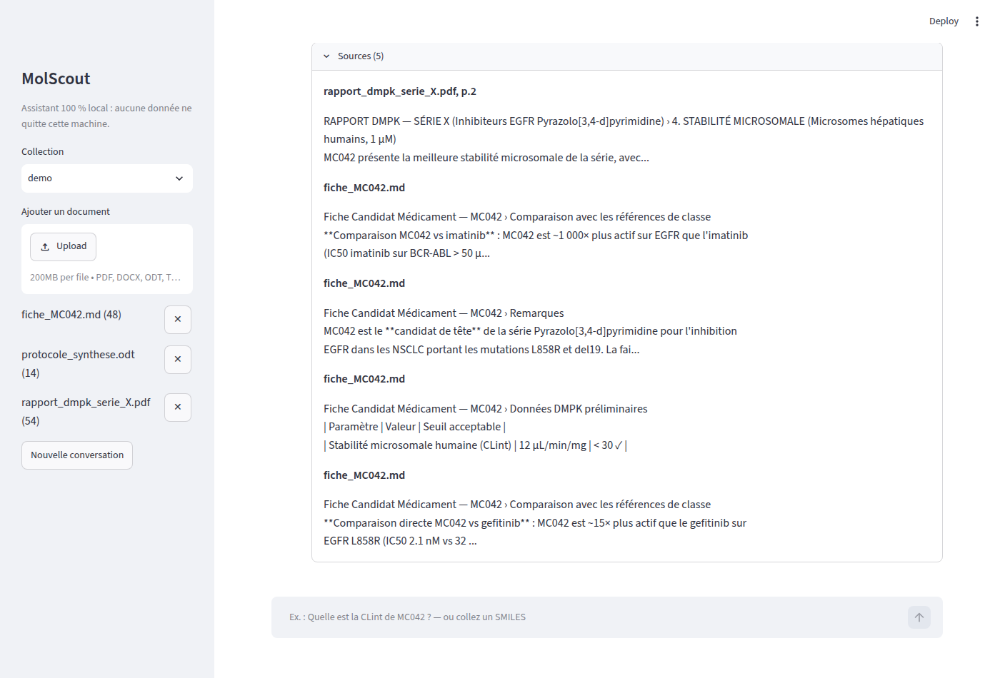

# MolScout

**Un assistant IA qui ne répond que ce qu'il peut prouver.** MolScout répond aux questions d'un chimiste à partir de ses propres rapports, cite le passage exact qui justifie chaque réponse, et calcule les propriétés des molécules au lieu de laisser le modèle les deviner. Il fonctionne entièrement en local : aucune donnée ne quitte la machine.

> **Stack :** Python · LangChain · LangGraph · Ollama · Qdrant · RDKit · FastAPI · Streamlit
>
> **Code source disponible sur demande** (dépôt privé).

---

## Contexte

Dans les équipes de recherche pharmaceutique, les documents internes (rapports d'études, fiches de molécules candidates, protocoles) s'accumulent et deviennent difficiles à interroger. Les assistants IA en ligne posent un problème de confidentialité : brevets, molécules et résultats d'essais ne doivent pas sortir de l'entreprise.

**Le problème :** retrouver une donnée précise dans des dizaines de documents prend du temps. Et un modèle de langage laissé seul peut se tromper avec assurance : confondre deux molécules voisines, ou inventer une valeur plausible.

**La solution : trois principes.**

- **Vérification, pas confiance** : chaque affirmation de la réponse est contrôlée, sans LLM, contre le passage exact qu'elle cite (extrait littéral, valeur, unité, composé). Si une affirmation ne passe pas ce contrôle, le système relance une génération guidée, puis répond partiellement ou s'abstient plutôt que d'affirmer à tort.
- **Chimie calculée, pas devinée** : descripteurs moléculaires, règle de Lipinski, similarité, sous-structure et résolution de SMILES viennent de RDKit et d'une chimiothèque locale, jamais du modèle de langage.
- **Local de bout en bout** : aucun appel réseau sortant, télémétrie désactivée dans le code, déploiement Docker sur réseau interne.

## Ce que le système fait

| Capacité | Détail |
|---|---|
| Ingestion PDF, DOCX, ODT, Markdown | Un passage structuré (en-tête, section, page) ; identifiants de composés et SMILES extraits ; propriétés déclarées contrôlées contre RDKit ; ingestion idempotente |
| Questions sur documents | Récupération hybride (dense + lexicale) avec filtre par composé ; réponses citées `[fichier, p.N]` et vérifiées |
| Questions sur une structure | SMILES reconnu et résolu quelle que soit son écriture ; propriétés, similarité de Tanimoto, sous-structure, cohérence déclaré/calculé |
| Conversation | Questions de suivi (« et son CLint ? ») résolues par session |
| Évaluation | 74 cas vérifiables, scorer déterministe, barrière de non-régression en intégration continue |
| Interface | Application web locale (Streamlit) : statut de vérification, sources, structure 2D |

## Architecture

```
Documents ─► extraction ─► passages structurés ─► embeddings + lexical ─► Qdrant
                                     └─► chimiothèque (SQLite)
Question ─► contexte ─► routeur (entités) ─┬─► récupération hybride ─┐
                                           └─► outils RDKit ─────────┤
                                                                     ▼
                                   génération structurée ─► vérification déterministe ─► réponse citée / abstention
```

Composants : LangGraph pour orchestrer le graphe (récupération, outils, génération, vérification) ; Ollama pour le LLM et les embeddings, entièrement en local ; Qdrant pour la recherche vectorielle ; RDKit pour la chimie ; SQLite pour la chimiothèque ; FastAPI pour l'API ; Streamlit pour l'interface.

## Aperçu

### Interface principale


*Assistant local, corpus indexé, prêt à répondre.*

### Réponse vérifiée


*Question posée sur un document réel du corpus de démonstration : réponse citée, statut « Vérifiée » et temps de calcul affichés.*

### Sources citées


*Les passages exacts utilisés pour construire et vérifier la réponse, consultables en un clic.*
