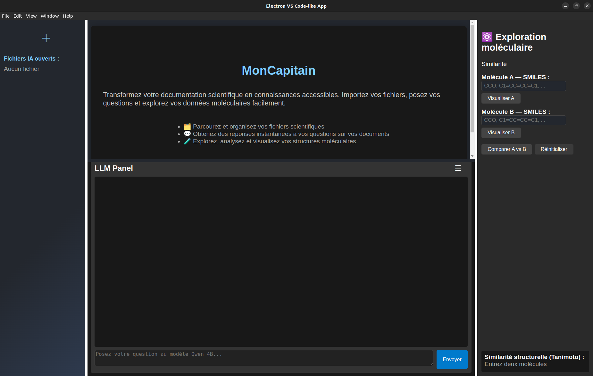
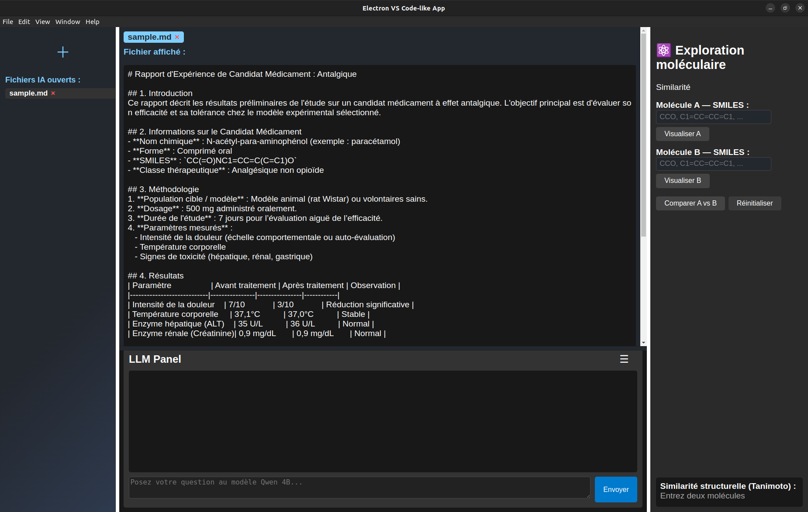
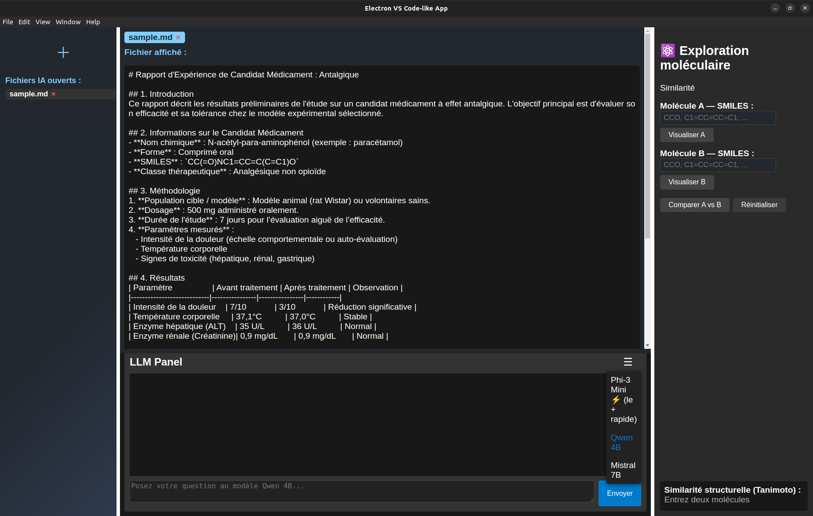
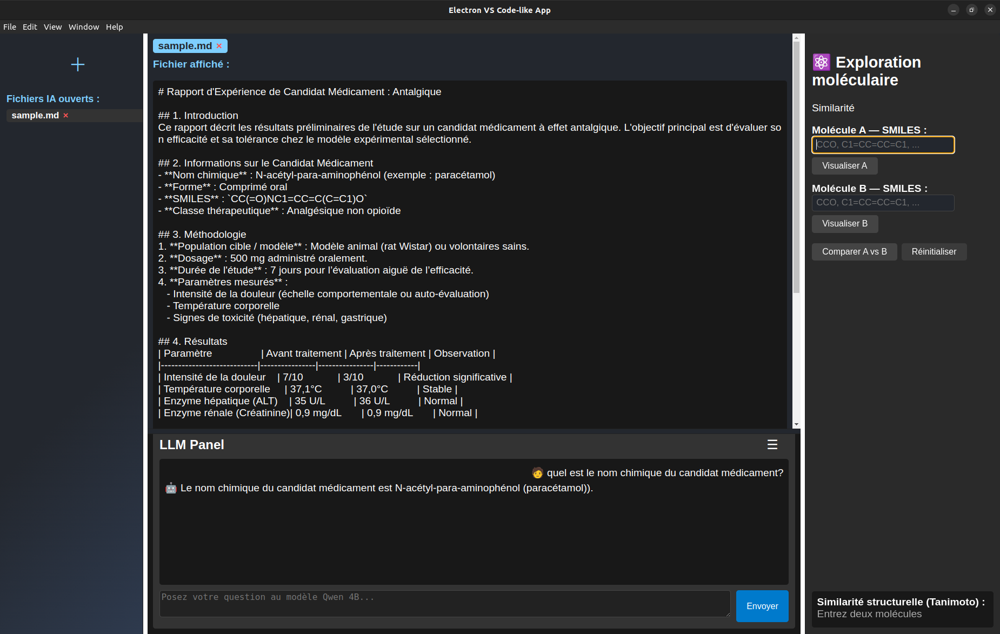
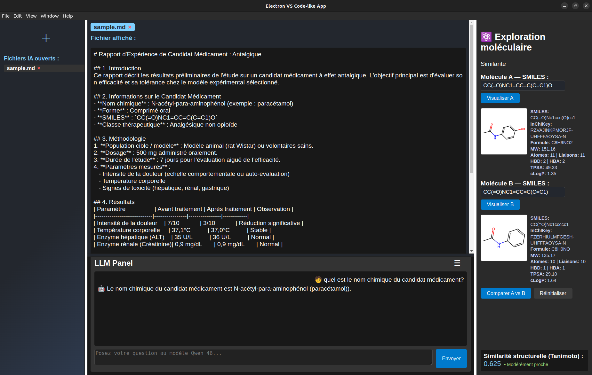

# MonCapitain — IA locale pour corpus documentaires scientifiques

> Projet en cours de développement — code source disponible prochainement.

---

## Le problème

Dans un contexte de recherche scientifique, les documents internes 
(rapports, articles, fiches techniques) s'accumulent et deviennent 
difficiles à interroger efficacement. Les solutions cloud posent 
des problèmes de confidentialité sur des données sensibles.

---

## La solution

MonCapitain est un système RAG (**Retrieval-Augmented Generation**) 
100% local — aucune donnée ne quitte la machine. Il permet 
d'interroger un corpus documentaire en langage naturel, 
avec des réponses ancrées dans les sources.

Au-delà du RAG, l'objectif est d'intégrer progressivement 
des modules chimio-informatiques (RDKit) pour faciliter 
la navigation dans des corpus scientifiques — recherche 
par structure moléculaire, calcul de similarité de Tanimoto, 
visualisation SMILES. Un premier module de similarité 
est déjà disponible, d'autres seront ajoutés selon les besoins.

---

## Stack technique

- LLM local via Ollama
- Recherche vectorielle
- API Python (FastAPI)
- Interface desktop
- Modules chimio-informatiques (RDKit)

---

## Fonctionnalités

- Extraction multi-format : PDF, DOCX, ODT, TXT, Markdown
- Chunking intelligent avec overlap et métadonnées
- Recherche vectorielle par similarité sémantique
- Génération de réponses avec citation des sources *(en cours)*
- Architecture modulaire — modules métier ajoutables selon le contexte
- Interface desktop locale

---

## Captures d'écran

### Lancement de l'application

*capture 1: interface principale MonCapitain*

### Ajout d'un document

*capture 2: import d'un document exemple*

### Choix du modèle LLM

*capture 3: sélection du modèle Ollama*

### Interrogation du corpus

*capture 4: question posée sur le document, réponse générée localement*

### Similarité moléculaire (module RDKit)

*capture 5: deux structures SMILES comparées, score de similarité affiché*

---

## État du projet

| Module | Statut |
|--------|--------|
| Extraction documents | ✅ Stable |
| Chunking | ✅ Stable |
| Embeddings + Qdrant | ✅ Stable |
| RAG avec citations | 🔄 En cours |
| Interface Electron | 🔄 En cours |
| Module RDKit | ✅ Disponible |

Couverture de tests actuelle : **69%**

---

## Ce qui reste à faire

- Finaliser le RAG avec vérification et citation des sources
- Réduire les hallucinations via prompt engineering et reranking
- Améliorer l'interface desktop
- Publier le code source sur GitHub

---

